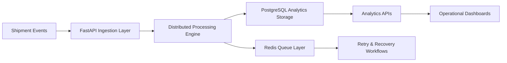
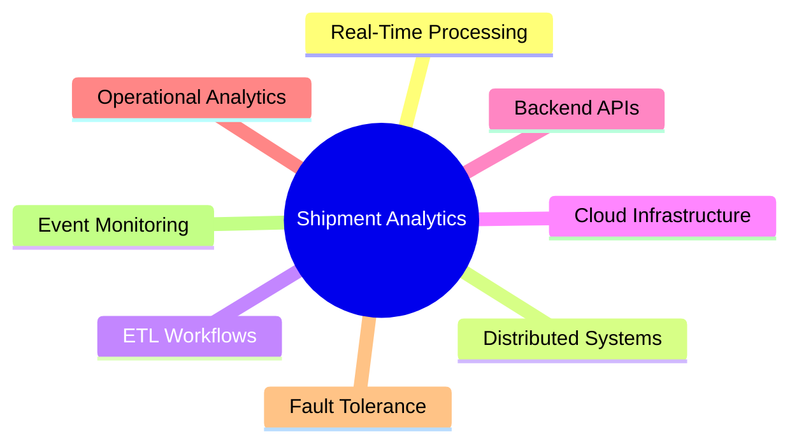

<div align="center">


<br>


<br><br>


</div>

---

# Overview

The Real-Time Shipment Tracking Analytics Platform is a cloud-native distributed logistics intelligence system designed to process and analyze high-volume shipment tracking events across scalable backend infrastructure.

The platform simulates enterprise-grade shipment operations involving:

- Delivery scan events
- Routing updates
- Warehouse processing
- Delay detection
- Real-time shipment monitoring
- Operational analytics pipelines

The architecture is designed to support scalable ingestion workflows, distributed event processing, backend reliability engineering, and operational observability for logistics ecosystems.

---

# Engineering Objectives

```yaml
Core Objectives:
  - Real-Time Shipment Visibility
  - Distributed Event Processing
  - Fault-Tolerant Analytics Pipelines
  - High Throughput Backend Processing
  - Scalable Cloud Deployment
  - Operational Monitoring
  - Logistics Intelligence Workflows
````

---

# System Architecture

<div align="center">



</div>

---

# Key Engineering Highlights

<div align="center">

| Capability               | Description                             |
| ------------------------ | --------------------------------------- |
| Real-Time Processing     | Continuous shipment event ingestion     |
| Distributed Architecture | Concurrent backend processing workflows |
| Analytics Infrastructure | SQL-powered operational reporting       |
| Fault Recovery           | Retry handling & event resilience       |
| Monitoring               | Operational visibility & analytics      |
| Cloud Deployment         | Dockerized AWS-ready infrastructure     |

</div>

---

# Core Features

## Real-Time Shipment Event Ingestion

* Shipment scan processing
* Routing updates
* Warehouse tracking events
* Delivery lifecycle monitoring
* Operational event synchronization

---

## Distributed Backend Processing

* Concurrent shipment processing
* Multi-threaded event handling
* Scalable ingestion architecture
* Backend throughput optimization
* Event coordination workflows

---

## Analytics & Operational Intelligence

* Delay analytics
* Shipment throughput metrics
* Event distribution tracking
* Logistics operational monitoring
* SQL aggregation reporting

---

## Reliability Engineering

* Retry handling
* Duplicate event validation
* Processing resilience
* Fault-tolerant event workflows
* Backend monitoring pipelines

---

# Tech Stack

<div align="center">

## Backend Engineering


<br><br>

## API Infrastructure


<br><br>

## Databases & Storage


<br><br>

## DevOps & Infrastructure


</div>

---

# Project Structure

```bash
├── main.py
├── database.py
├── models.py
├── routes.py
├── services.py
├── schemas.py
├── event_worker.py
├── delay_analytics.py
├── init_db.py
├── load_sample_data.py
├── Dockerfile
├── docker-compose.yml
├── requirements.txt
└── README.md
```

---

# API Endpoints

| Method | Endpoint   | Description            |
| ------ | ---------- | ---------------------- |
| POST   | /shipments | Create shipment        |
| POST   | /events    | Process shipment event |
| GET    | /health    | System health check    |

---

# Deployment Workflow

```yaml
Deployment Stack:
  - Docker Containers
  - PostgreSQL Database
  - Redis Queue Layer
  - FastAPI Backend Services
  - AWS EC2 Compatible Infrastructure
```

---

# Scalability Focus

The platform architecture was designed with emphasis on:

* Horizontal backend scalability
* Distributed event ingestion
* SQL optimization
* Backend throughput improvement
* Fault recovery mechanisms
* Operational observability
* Analytics-driven monitoring

---

# Performance Engineering

<div align="center">

| Optimization Area | Engineering Focus          |
| ----------------- | -------------------------- |
| SQL Queries       | Aggregation Optimization   |
| Processing        | Concurrent Event Workflows |
| Reliability       | Retry Recovery Mechanisms  |
| Monitoring        | Event Health Visibility    |
| Infrastructure    | Containerized Deployment   |

</div>

---

# Operational Analytics

The platform supports operational visibility for:

* Shipment delays
* Failed event tracking
* Processing throughput
* Delivery analytics
* Warehouse activity monitoring
* Logistics performance evaluation

---

# Containerized Infrastructure

```bash
docker-compose up --build
```

The project is fully containerized and supports rapid deployment across cloud-native infrastructure environments.

---

# Engineering Domains

<div align="center">



</div>

---

# Future Enhancements

* Kafka-based event streaming
* Kubernetes orchestration
* Real-time dashboard visualization
* Predictive shipment analytics
* ML-based delay forecasting
* Distributed queue partitioning
* Event replay systems

---

# Repository Setup

```bash
git clone <repository-url>

cd real-time-shipment-tracking-analytics-platform

docker-compose up --build
```

---

# Engineering Focus Areas

<div align="center">

| Engineering Area    | Focus                         |
| ------------------- | ----------------------------- |
| Backend Systems     | High Throughput APIs          |
| Distributed Systems | Concurrent Event Processing   |
| Data Engineering    | Real-Time Logistics Pipelines |
| Cloud Engineering   | AWS Ready Infrastructure      |
| Analytics           | Operational Intelligence      |

</div>

---

# License

This project is intended for educational, portfolio, and engineering demonstration purposes.

---

<div align="center">

## Distributed Logistics Intelligence • Real-Time Event Processing • Cloud Native Analytics


</div>
```
